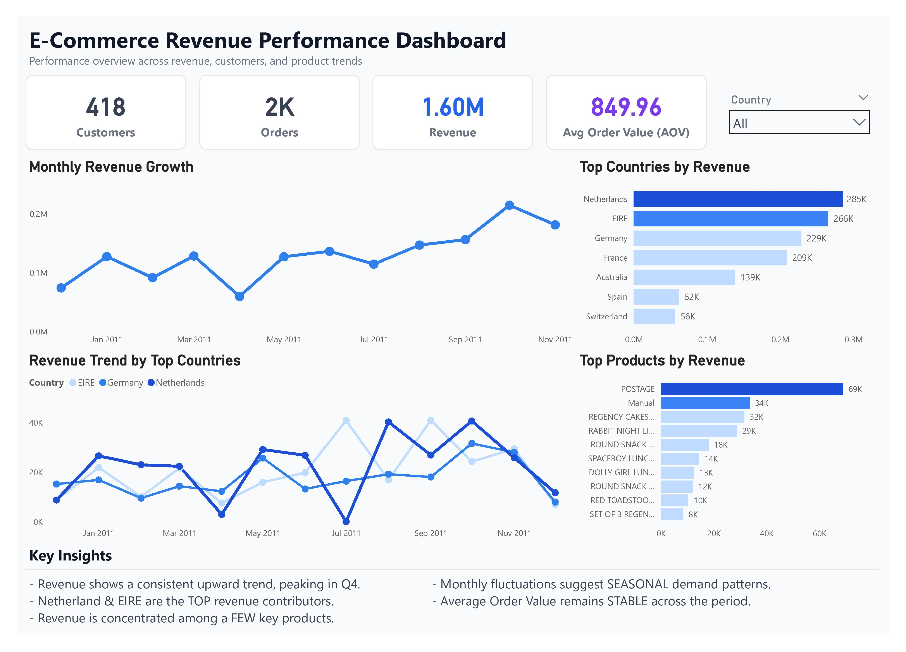

# 📊 E-Commerce Revenue Insights Dashboard (Power BI)

## 📸 Dashboard Preview

## 🔍 Overview
This project presents an interactive Power BI dashboard designed to evaluate e-commerce revenue performance and identify key business drivers across customers, products, and geographic markets.  
The focus is on translating raw transactional data into clear, decision-oriented insights.

## 📌 Key Insights
- Revenue demonstrates a strong upward trajectory, with a clear peak in Q4 indicating seasonal demand concentration  
- Netherlands and EIRE emerge as the highest revenue-generating regions, highlighting geographic dependency  
- Revenue is heavily concentrated among a limited set of products, suggesting reliance on top-performing SKUs  
- Monthly volatility reflects underlying seasonal purchasing patterns across markets  
- Average Order Value remains stable, indicating consistent customer spending behavior over time  

## 🛠 Tools & Skills
- Power BI (Data Modeling, DAX, and Interactive Visualization)  
- Data Analysis & Business Insight Generation  
- Dashboard Design & Information Hierarchy  

## 📂 Project Structure
- `data/` → Source dataset  
- `dashboard/` → Power BI (.pbix) file  
- `images/` → Dashboard preview  

## 🚀 Usage
Download the `.pbix` file and open it in Power BI Desktop to explore the interactive dashboard and apply filters for deeper analysis.

---
💡 This project demonstrates the ability to transform raw data into structured insights that support business decision-making.
